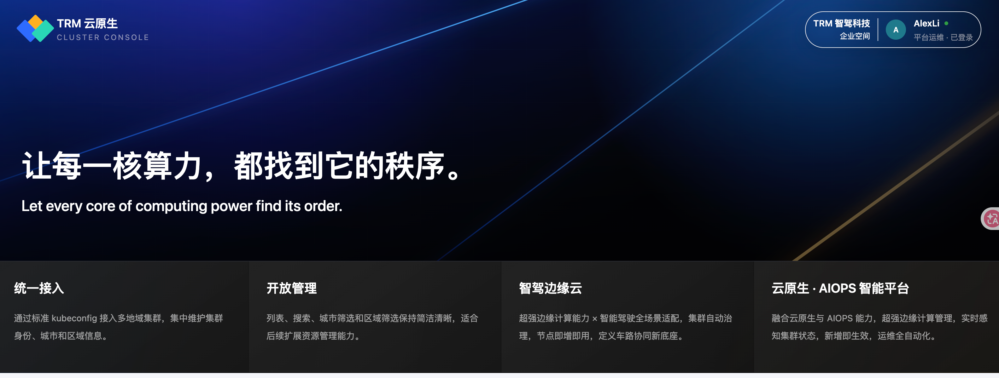
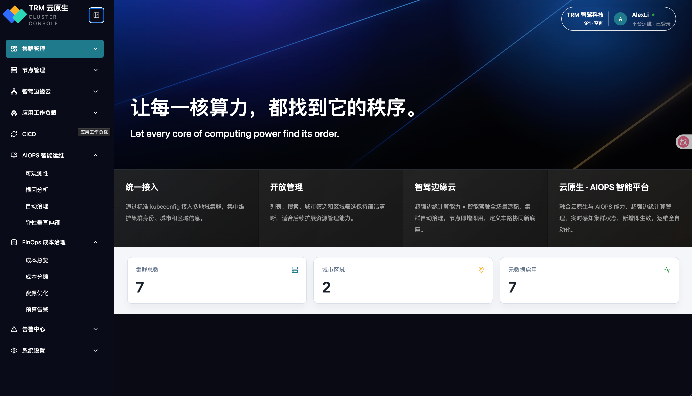

# TRM 云原生 Cluster Console

TRM 云原生 Cluster Console 是一个面向 Kubernetes 多集群、边缘云、AIOPS 和 FinOps 场景的前端控制台 Demo。项目当前从轻量原型开始，重点验证多集群接入、列表查询、集群添加、二级菜单信息架构和开源产品风格的控制台体验。

## 功能特性

- 多集群列表查询：对接 `/api/cluster/list`，支持搜索、城市筛选、区域筛选。
- 添加集群：填写集群名称、城市、区域，上传 kubeconfig 文件并提交到 `/api/cluster/add`。
- 自动 ID：添加集群前基于当前列表中的最大数字 ID 自增。
- 云原生导航：覆盖集群管理、节点管理、智驾边缘云、工作负载、CICD、AIOPS、FinOps、告警中心和系统设置。
- 二级菜单：每个模块预置子能力入口，便于后续逐步接入真实后端。
- 视觉体验：深色科技首屏、侧边栏折叠、滚动视差背景、轻量用户信息区。

## 技术栈

- Vue 3
- Vite
- Pinia
- Tailwind CSS
- lucide-vue-next

## 快速开始

## 菜单规划

- 集群管理：集群总览、列出集群、添加集群、健康巡检、版本升级
- 节点管理：节点列表、节点池、节点维护
- 智驾边缘云：边缘站点、设备接入、边缘网络
- 应用工作负载：Deployment、Service / Ingress、GitOps 发布
- CICD：CI / GitLab、CD / Argo CD、流水线模板、制品管理
- AIOPS 智能运维：可观测性、根因分析、自动治理、弹性垂直伸缩
- FinOps 成本治理：成本总览、成本分摊、资源优化、预算告警
- 告警中心：告警规则、告警事件、通知渠道
- 系统设置：权限管理、审计日志、平台集成

## 项目结构

## License

