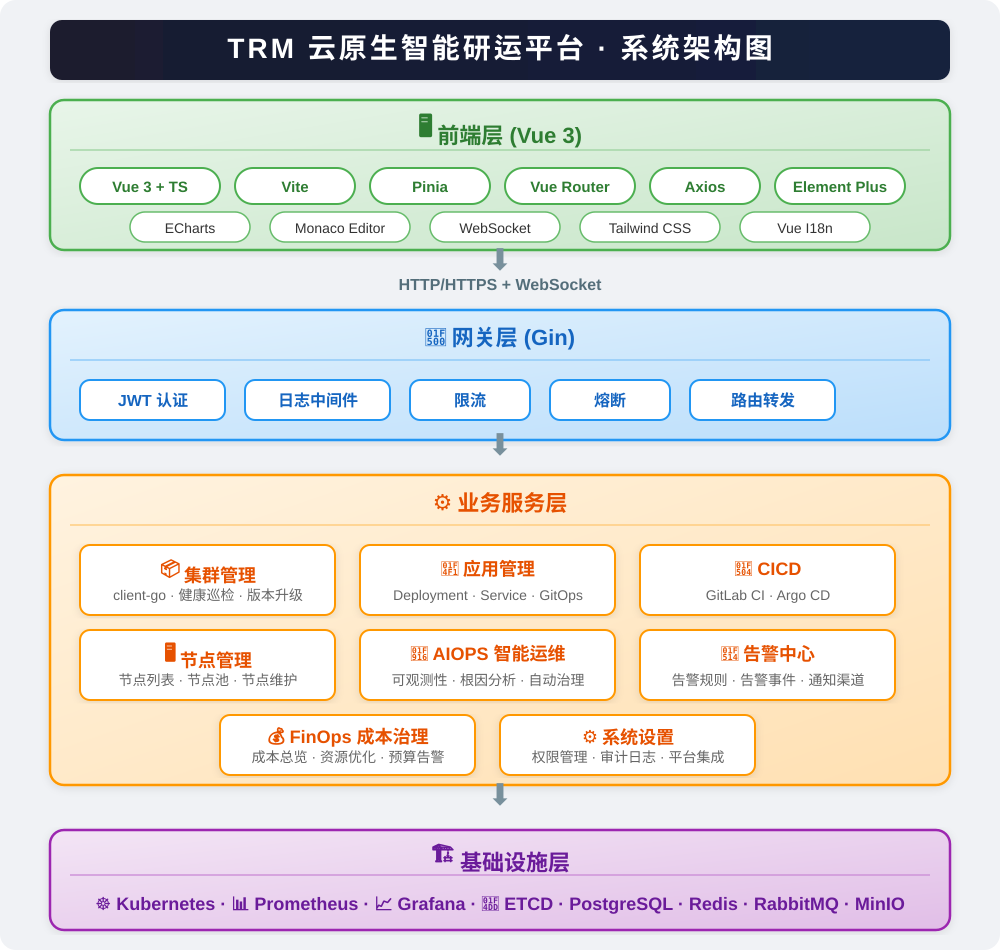

# TRM 云原生智能研运平台

[中文](README.md) | [English](README_en.md)

TRM `云原生智能研运平台` 是一个面向 Kubernetes 多集群、边缘云、AIOPS 和 FinOps 场景的云平台。

## 功能特性

- 集群管理：集群总览、列出集群、添加集群、健康巡检、版本升级
- 节点管理：节点列表、节点池、节点维护
- 智驾边缘云：边缘站点、设备接入、边缘网络
- 应用工作负载：Deployment、Service / Ingress、GitOps 发布
- CICD：CI / GitLab、CD / Argo CD、流水线模板、制品管理
- AIOPS 智能运维：可观测性、根因分析、自动治理、弹性垂直伸缩
- FinOps 成本治理：成本总览、成本分摊、资源优化、预算告警
- 告警中心：告警规则、告警事件、通知渠道
- 系统设置：权限管理、审计日志、平台集成

## 技术栈

- 前端	Vue 3 + TypeScript + Vite + Element Plus + ECharts
- 后端	Go + Gin + GORM + client-go
- 数据	PostgreSQL + Redis
- 监控	Prometheus + Grafana
- K8s 交互	client-go + controller-runtime
- CI/CD	GitLab CI + Argo CD
- 消息	RabbitMQ / Kafka
- 权限	Casbin + JWT

## 快速开始

## 项目架构

## License

